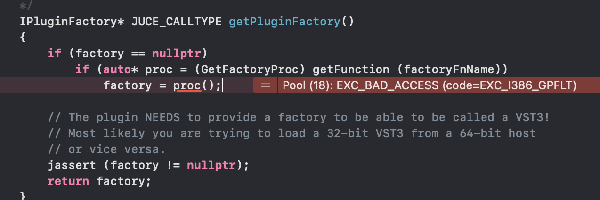

# **First Audio Plugin**

## **Overview**

Hello! I'm making my first audio plugin with JUCE. Music plugins are my favourite thing to buy and I've always been curious to make one myself. This is a repository to document the process, test things out and make mistakes.

This is a side project for when I have a bit of free time so please bear with - the updates will be a little slow! 

 
 

## **Table of Contents**

[Overview](#overview)

[First Issue!](#first-issue)

[Credits](#credits)

 
 

## **First Issue!**

I'm using a tutorial to guide me through JUCE/Projucer setups and eventually making a plugin. JUCE & Projucer are installed, I'm scanning for the plugin file I've built and have already hit a problem...

When I do *build > options > edit the list of available plugins > options > scan for new or updated VST3s > scan* Projucer crashes.

I get the error code: **EXC_BAD_ACCESS** on line 993

Did some Googling and tried enabling zombie objects in Xcode to fix it. Used the same method as above to crash the program again and… got a different error message?!

**Line 232 EXC_BREAKPOINT code=EXC_i386_BPT**

<!--Perhaps this is the problem? https://stackoverflow.com/questions/40317901/exc-breakpoint-code-exc-i386-bpt-subcode-0x0-with-32-bit-simulator-->

Wondered if it would work with a different scan mode - changed scan mode to **out-of-process**. It no longer crashed and succesfully scanned!

However, I was scanning plugins to find the plugin I’m making and it wasn’t there 😂. I don’t think it’s being built, as it doesn't seem to be *anywhere* on my system. 

Maybe the JUCE installation process went wrong? Tried reinstalling JUCE (via the website) and the plugin still isn't appearing in the list. 

I have some more things to try. Will update these notes soon!

<!--Look at docs:
https://juce.com/learn/documentation
https://juce.com/learn/tutorials-->

 
 

## **Credits**

[FreeCodeCamp.org & Matkat Music](https://www.youtube.com/watch?v=Mo0Oco3Vimo&t=350s)

[Enable zombie objects in Xcode](https://code.tutsplus.com/tutorials/what-is-exc_bad_access-and-how-to-debug-it--cms-24544)
